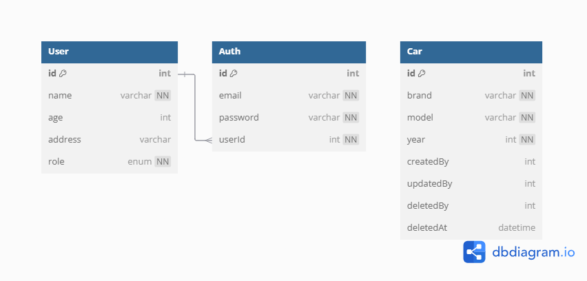

# CAR MANAGEMENT API

## Deskripsi

Proyek ini merupakan output dari Chaleenge 5 Binar Academy.

## Fitur Utama

- **Login**: Endpoint untuk melakukan login.
- **Membuat Admin**: Superadmin memiliki akses eksklusif untuk menambahkan admin baru.
- **Registrasi Member**: Endpoint yang memungkinkan pengguna melakukan registrasi sebagai member.
- **CRUD Data Mobil**: Tersedia 4 endpoint CRUD untuk data mobil. User biasa hanya bisa mengakses fitur GET. Admin dan superadmin yang dapat mengakses semua fitur.
- **Current User**: Endpoint untuk melihat informasi pengguna yang sedang login berdasarkan token yang dimiliki.

### Data Mobil

- **Dibuat oleh**: Informasi pengguna yang membuat data mobil.
- **Dihapus oleh**: Informasi pengguna yang menghapus data mobil.
- **Terakhir Diperbarui oleh**: Informasi pengguna yang terakhir kali mengupdate data mobil.

## ERD

## API DOCS ENDPOINT & Superadmin Credentials

http://localhost:3000/api-docs
email: superadmin@example.com
pass: superadmin
